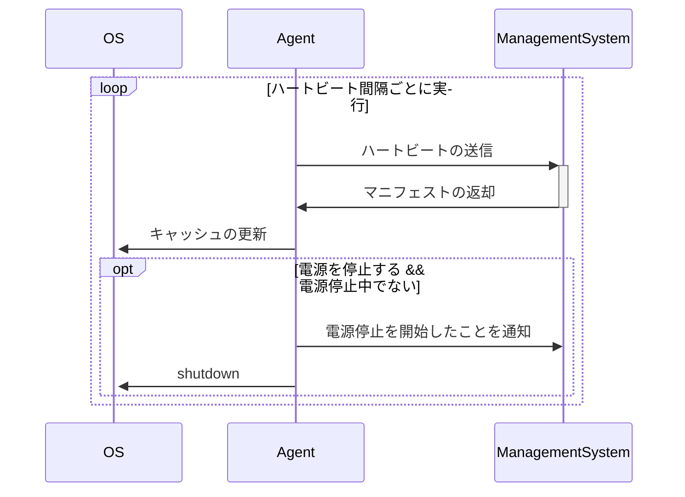
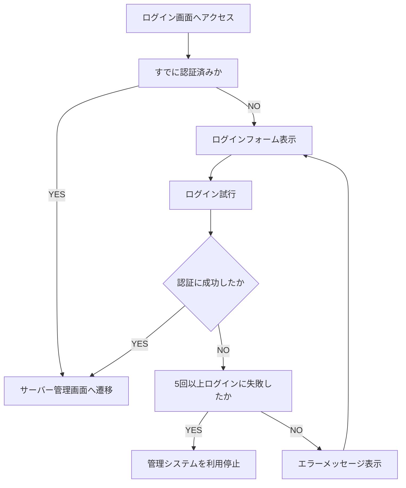
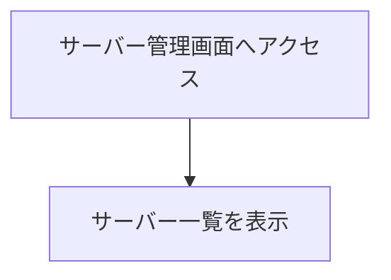
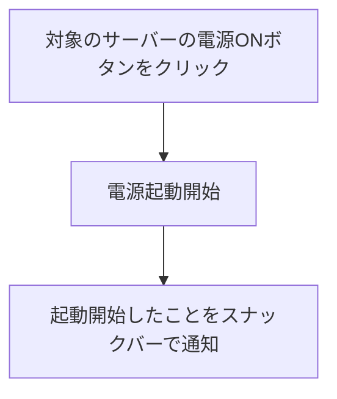
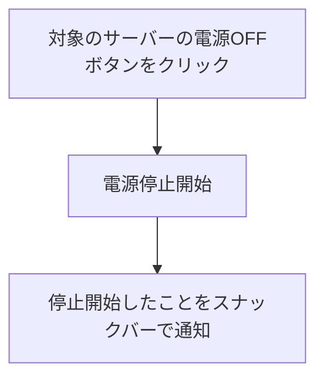
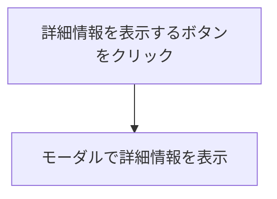
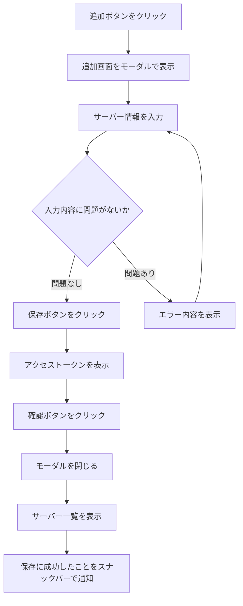
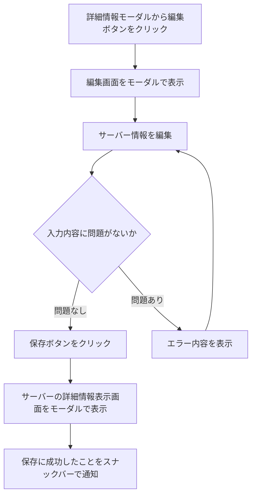
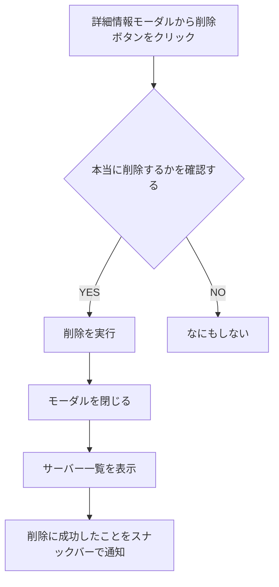

# cluster-power-manager

## 要求定義

### なぜ行うのか

オンプレ環境でサーバーを保守・運用する際に、例えば深夜は使うことがないといったような、常時利用されるわけではないサーバーが存在するケースがある。基本的に常時稼働はサーバーに負荷をかけるケースが多いので、1 日に 1 回程度の電源の ON/OFF であれば、使わないときに電源を落としておくほうがサーバーへの負荷の面でも電気代の面でもメリットを上回るケースが多い。

ところが、こうした電源管理を行うサーバーが複数台存在する場合、各サーバーの電源を落とすという作業が発生する。  
物理ボタンを用いて電源を落とすことも可能だが、数が多ければその分ボタンを押す手間がかかったり、そもそも電源ボタンが手に届かない場所にあるケースも存在する。  
また、SSH でコマンドを実行することも考えられるが、電源操作には管理者権限を要するため、コマンド実行時にパスワードを要求されるケースがほとんどになる。パスワード入力の回数はサーバーの数だけ増え、また堅牢なパスワードを利用していればその分だけ入力に時間がかかる。

そのため、上記の問題をセキュリティ上の安全を確保しつつ、より簡単に行える仕組みを導入することには、日々の面倒な電源管理の負担を軽減しつつ、冒頭の恩恵を得ることが可能になる点において実行の価値がある。

### 何を行うのか

- 上記の問題を解決するための管理画面およびサーバーの開発
- スマートフォンや PC のブラウザからアクセス可能な Web アプリケーションとして提供
  - このシステムはあくまでオンプレ環境の管理者のみが利用することを想定しており、パブリックなインターネットに公開することは想定していない。
  - ただし、Tailscale や Cloudflare Tunnel 等のゼロトラストネットワークを用いたシステムの構築が昨今では容易になっており、こうしたものを仮定するならば、Web アプリケーションとして提供することには利便性の面においてメリットがある。
- システムを利用するユーザーの認証
- システムの配下に置くサーバーの追加・編集・削除
- 各サーバーの電源を管理する仕組み

### 何を行わないのか

- Web サーバーのパブリック化に伴うセキュリティ対策
  - パブリック: インターネットに接続可能な任意のユーザーからアクセスができる状態

### 何をもって成功とするのか

- サーバーの電源管理に伴う時間的コストが 0 になること

### トレードオフスライダー

- スコープ: 1（最小限の機能を持つ MVP）
- 予算: 2（必要な分だけコストを割くことが許される）
- スケジュール: 4（可能な限り早くリリースを行う）
- 品質: 3（テスト計画上の品質は確実に担保する）

## 要件定義

### 用語の定義

- **User / ユーザー**
  - 管理システムを利用する管理者
- **Server / サーバー**
  - 電源管理をおこなう対象の物理サーバー
  - サーバーは管理システムが規定する電源ステータスに従う
- **Management System / 管理システム**
  - 各サーバーの電源管理を行うアプリケーション
  - 管理システムは各サーバーがあるべき電源ステータスを規定する
  - エージェントが参照する API や、ユーザーがアクセスする管理画面を提供する
- **Agent / エージェント**
  - 各サーバーに在中し、管理システムとの通信を行うデーモン
- **Manifest / マニフェスト**
  - 各サーバーがあるべき状態を規定した情報
  - 内容
    - 電源ステータス（ON/OFF）
    - ハートビート間隔
- **Wake-on-LAN (WoL)**
  - サーバーの電源を起動するための仕組み
  - 管理システムが、MAC アドレスを用いて Magic Packet を送出する
  - 前提条件:
    - サーバーの BIOS/UEFI で WoL が有効化されている
    - 管理システムとサーバーが同一ネットワークセグメント内にある（またはルーターが WoL パケットを転送可能）
- **Heartbeat / ハートビート**
  - エージェントが管理システムへ送信する死活状態
- **Heartbeat Interval / ハートビート間隔**
  - エージェントが送信するハートビートの間隔
- **Standby Time / 待機時間**
  - 電源の ON/OFF までに許容できるタイムラグ
  - 待機時間中は電源操作が行えない
  - 初期値: 5 分
- **Power Status / 電源ステータス**
  - 管理システムが規定する、各サーバーのあるべき電源の状態
  - 種類
    - ON
      - 意味: 電源が起動している
      - 条件: 管理システム上で電源ステータスを ON にした場合
    - OFF
      - 意味: 電源が停止している
      - 条件: 管理システム上で電源ステータスを OFF にした場合
- **Heartbeat Status / ハートビートステータス**
  - 各サーバーがハートビートで報告する現在の電源の状態
  - ハートビートで報告する内容は基本的にマニフェストの内容に従う
  - 種類
    - ON
      - 意味: 電源が起動している
      - 条件:
        - サーバーの電源起動から初回のハートビートを報告する場合
        - マニフェストの電源ステータスが ON、かつハートビートを正常に報告できる場合
    - Stopping:
      - 意味: 電源を停止中
      - 条件: マニフェストの電源ステータスが OFF、かつハートビートを正常に報告できる場合
    - None（報告なし）
      - 意味: エージェントが停止している
      - 条件: エージェントがハートビートを報告できない状況にあるとき
- **Actual Status / アクチュアルステータス**
  - 電源ステータスとハートビートステータスの状況から算出される現在の状態
  - 種類
    - ON
      - 意味: 電源が起動している
      - 条件: 電源ステータスが ON、かつハートビートステータスが ON
    - OFF
      - 意味: 電源が停止している
      - 条件: 電源ステータスが OFF、かつ前回のハートビートステータスが Stopping、かつ現在のハートビートステータスが None
    - Starting
      - 意味: 電源を起動中
      - 条件: 電源ステータスを ON にしてから待機時間内、ハートビートステータスが None
    - StartupDelayed
      - 意味: 電源を起動したがサーバーから応答がない場合
      - 条件: 電源ステータスを ON にしてから待機時間以上が経過、ハートビートステータスが None
    - BeforeStopping
      - 意味: 電源の停止を開始した
      - 条件: 電源ステータスを OFF にしてから待機時間内、前回のハートビートステータスが ON、かつ現在のハートビートステータスが ON
    - Stopping
      - 意味: 電源を停止中
      - 条件: 電源ステータスを OFF にしてから待機時間内、かつハートビートステータスが Stopping
    - ShutdownDelayed
      - 意味: 何らかの理由でサーバーの電源を停止できない場合・停止に時間がかかっている場合
      - 条件: 電源ステータスを OFF にしてから待機時間以上が経過、かつハートビートステータスが Stopping
    - ManuallyON（表記上は ON）
      - 意味: サーバーが手動で電源がオンになった場合
      - 条件: 電源ステータスが OFF、前回のハートビートステータスが None または Stopping、かつ現在のハートビートステータスが ON
      - 補足
        - 管理者が明示的に電源を入れる意思があったと解釈し、自動的に電源ステータスを ON に変更する
    - Crashed
      - 意味: サーバーが何らかの理由でクラッシュしていると考えられるとき
      - 条件: 前回のハートビートステータスが ON、かつ現在のハートビートステータスが None
      - 補足
        - ユーザーが手動でサーバーの電源を落とした場合が考えられるため、その場合は電源ステータスを OFF にするようフッターにて通知する必要がある
    - Unknown
      - 意味: 想定しない状況であるとき
      - 条件: 上記以外
      - 補足
        - Unknown になった場合はユーザーにその旨をフッターを用いて通知

### 各ステータスの関係性

| 電源ステータス | 前回のハートビートステータス | 現在のハートビートステータス | アクチュアルステータス     | 状況                                                                                                                                                                                                           |
| -------------- | ---------------------------- | ---------------------------- | -------------------------- | -------------------------------------------------------------------------------------------------------------------------------------------------------------------------------------------------------------- |
| ON             | ON                           | ON                           | ON                         | （OK）正常稼働                                                                                                                                                                                                 |
| ON             | ON                           | Stopping                     | Unknown                    | （あり得ない）Stopping は電源ステータスが OFF のときのみ                                                                                                                                                       |
| ON             | ON                           | None                         | Crashed                    | （要対応）クラッシュした or 手動で電源が OFF                                                                                                                                                                   |
| ON             | Stopping                     | ON                           | Unknown                    | （あり得ない）Stopping は電源ステータスが OFF のときのみ、かつ待機時間中は電源ステータスを変更できない                                                                                                         |
| ON             | Stopping                     | Stopping                     | Unknown                    | （あり得ない）〃                                                                                                                                                                                               |
| ON             | Stopping                     | None                         | Unknown                    | （あり得ない）〃                                                                                                                                                                                               |
| ON             | None                         | ON                           | ON                         | （OK）電源が入った or クラッシュ状態から復帰した or 手動で電源を落としてから再度入れた → 正常稼働になった                                                                                                      |
| ON             | None                         | Stopping                     | Unknown                    | （あり得ない）Stopping は電源ステータスが OFF のときのみ                                                                                                                                                       |
| ON             | None                         | None                         | Unknown                    | （あり得ない）None が連続で報告されることはない                                                                                                                                                                |
| OFF            | ON                           | ON                           | BeforeStopping             | （OK）基本的には電源ステータスを OFF にした直後。ただ、電源ステータスを OFF にし、すぐサーバーの電源を手動で停止、再度起動した後、ハートビート間隔内に初回ハートビートを送信できれば行けるが、これは考慮しない |
| OFF            | ON                           | Stopping                     | Stopping                   | （OK）停止処理開始                                                                                                                                                                                             |
| OFF            | ON                           | None                         | Crashed                    | （要対応）Stopping を経由せずにいきなり None になるのはサーバーがクラッシュしているか手動で電源 OFF の可能性が高い                                                                                             |
| OFF            | Stopping                     | ON                           | ManuallyON                 | （OK）サーバーの電源が OFF になった後、すぐ電源を手動で ON にし、ハートビート間隔内にハートビートが送信できた場合 → 電源ステータスを ON に変える                                                               |
| OFF            | Stopping                     | Stopping                     | Stopping / ShutdownDelayed | （正常 or 要対応）待機時間内であれば正常、待機時間外であればシャットダウンに時間がかかっている                                                                                                                 |
| OFF            | Stopping                     | None                         | OFF                        | （OK）正常に電源が落ちた                                                                                                                                                                                       |
| OFF            | None                         | ON                           | ManuallyON                 | （OK）手動で電源が ON になった → 電源ステータスを ON に変える必要がある                                                                                                                                        |
| OFF            | None                         | Stopping                     | Unknown                    | （あり得ない）一度電源が落ちた状態から初回のハートビートは必ず ON になるためあり得ない                                                                                                                         |
| OFF            | None                         | None                         | Unknown                    | （あり得ない）None が連続で報告されることはない                                                                                                                                                                |

### エージェント（WIP）

- エージェントは、管理システムに向けて指定されたハートビート間隔で死活状況を報告する
  - 電源ステータス（ON/Stopping）
- 死活状況を報告した際に、管理システムからマニフェストを受け取る
  - あるべき電源ステータス（ON/OFF）
  - ハートビート間隔
- マニフェストに書かれた情報に基づいてサーバーの電源を停止する
- 電源を停止しようとしているときでも管理システムに対してハートビートは送信し続ける
- 電源を停止しようとしているときに、電源を停止する旨のマニフェストを受け取ったとしてもシャットダウン処理は重複して行わない

### ログイン画面（/login）（WIP）

ユーザーの認証を行う画面。

#### ユーザーの認証

- ユーザーは ID とパスワードを用いて認証を行う
- ユーザーは事前に登録されている必要があり、新規登録は行わない
- 認証に成功した場合、セッションを発行し、以降のアクセスに対して認証済みとして扱う
- セッションの有効期限は 24 時間とする
- セッションの有効期限が切れていた場合は未認証状態となる
- 管理システムが利用停止になった場合、ユーザーはログインすることができなくなる
  - DB の値を書き換えない限り復旧できない

### サーバー管理画面（/servers）（WIP）

サーバーを個別に管理する画面。

#### 管理下にあるサーバーの一覧表示

- 管理下にある各サーバーの情報を一覧を表示する
  - サーバー名
  - サーバーに割り振られる一意の ID
  - 電源ステータス
  - アクチュアルステータス
  - 電源ボタン
    - 電源ステータスが OFF または Unknown の場合は ON ボタンを表示
    - 電源ステータスが ON の場合は OFF ボタンを表示
  - サーバーの詳細情報を表示するボタン

#### サーバーの電源起動

- 電源の起動は管理システムから対象のサーバーに対して Magic Packet を送出する（WoL）
- 電源起動後のサーバーの電源ステータスは Starting となる

#### サーバーの電源停止

- 電源停止後のサーバーの電源ステータスは Stopping となる

#### サーバーの詳細情報の表示

- 以下の情報をモーダルで表示する
  - サーバー名
  - サーバーに割り振られる一意の ID
  - 電源状態
  - MAC アドレス
  - ハートビート間隔
  - 編集ボタン
  - 削除ボタン

#### サーバーの追加

- サーバー追加モーダルを表示し、以下の内容を入力する
  - サーバー名（必須）
    - 1 文字以上の文字列
  - MAC アドレス（必須）
    - パターン: `/^[0-9A-Fa-f]{2}(:[0-9A-Fa-f]{2}){5}$/`
  - ハートビート間隔（必須）
    - 単位: s
    - 正の整数のみ
    - 初期値: 60s
- アクセストークンは発行時のみ表示し、以降画面上に表示されることはない
- アクセストークン表示時に使い方を明記する

#### サーバーの編集

- 編集モーダルは、詳細モーダルに重ねて表示するのではなく、詳細情報を表示していたモーダルの内容を編集フォームへと差し替えて表示する
- 現在の設定がフォームに入力された状態で表示
- 編集項目は「サーバーの追加」の内容と同じ

#### サーバーの削除

### ヘッダー・フッター・ナビゲーション

#### ヘッダー

- ヘッダー左側
  - アプリケーション名（Cluster Power Manager）と現在のページ名を表示する
- ヘッダー右側
  - 人間のシルエットが描かれた丸いアイコンを表示
  - アイコンをクリックすると、ドロップダウンで「ログアウト」ボタンが表示される
  - ログアウトボタンをクリックするとログアウトが実行され、ログインページへと遷移する

#### ナビゲーションバー

- 画面左側にナビゲーションバーを在中させる
- ナビゲーションには各ページへのリンクが存在する
  - 現在はサーバー管理画面のみ

#### エラー・警告通知（フッター）

- エラー・・警告通知は常に最上位のレイヤーとして表示される
  - モーダルよりも上に表示される
- アプリケーションで規定されているエラーや、その他予期しないエラーが発生した場合はすべてフッターに表示する
- フッターの右側にはバツボタンが表示されており、クリックするとフッターが閉じる

### 非機能要求

- 快適に管理システムを利用できるパフォーマンス
  - 特にエージェントは在中するため、サーバーのリソースを大きく消費してはならない

### 次回以降のリリース

- サーバーセット管理画面の実装
  - 登録した複数のサーバーに対して一括で電源操作を行う機能
