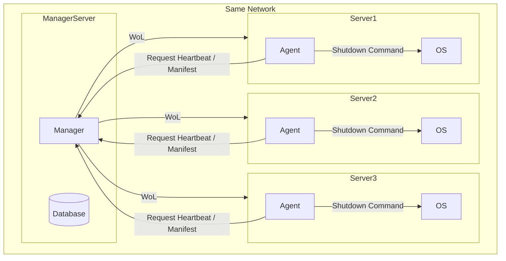
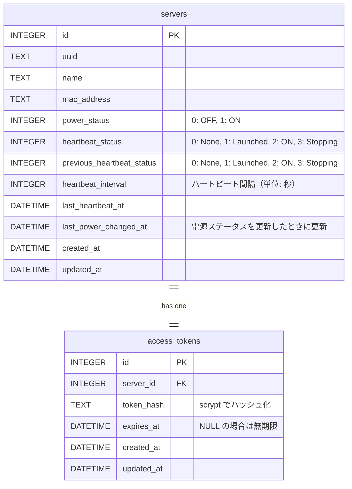
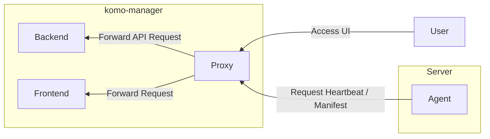
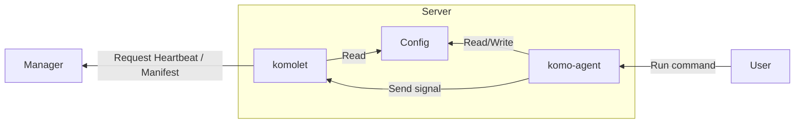
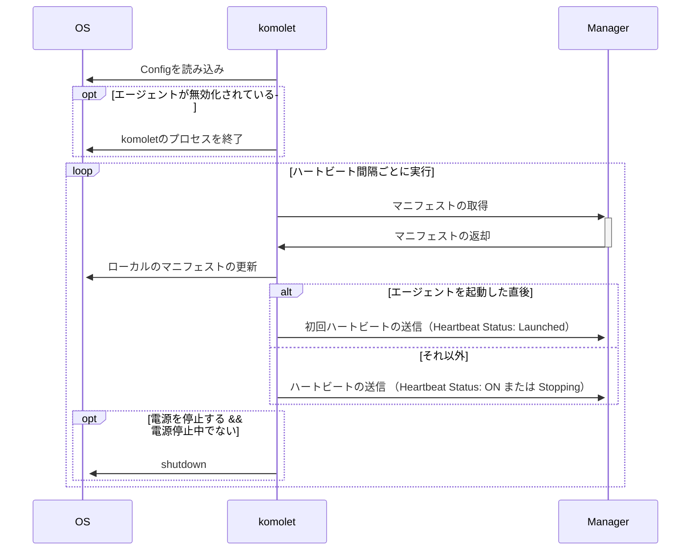

# System Design Document - システムデザイン

## Architecture



- サーバーの起動には Wake-on-LAN （WoL）を使用する
  - サーバーの BIOS/UEFI で WoL が有効化されている
  - マネージャーとサーバーが同一ネットワークセグメント内にある（またはルーターが WoL パケットを転送可能）

## Database

- RDB: sqlite
- DELETE は物理削除で行う

### Tables



## Manager

マネージャーは `komo-manager` という 単一の実行ファイルで動作し、バックエンドとフロントエンド、及びそれらのプロキシで構成される



### Technology Stack

- Language: TS (Bun)
  - バックエンドとフロントエンドの言語を統一し、開発効率の向上を図る
  - 高速な JS 実行環境
  - 単一バイナリをコンテナで実行可能
- Proxy: Bun Serve
  - nginx 等を利用せずに bun 単体で http/https のプロキシが可能
- Backend Framework: ElysiaJS
  - JS 上最も高速なバックエンドフレームワーク
  - Connect を用いて protobuf からサーバーコードを生成可能
- UI Library: React
  - 開発者の技術スタックとして React が最も馴染み深いこと
- Design: shadcn/ui
  - ある程度完成されたコンポーネントを活用しつつ、柔軟性や拡張性も確保できること
- Containerization: Podman
  - Docker 互換のコンテナランタイム
  - rootless コンテナのサポート
  - k8s との親和性
  - 開発環境ではソースコードをマウントして使用
  - 本番環境では単一バイナリへコンパイルし、軽量コンテナで実行

### Usage

- コマンド
  - `komo-manager`
- 概要
  - マネージャーを起動する
- args/option
  - なし
- environment variables
  - `DISABLE_FILE_LOG=<boolean>`: ファイル出力を無効化する（デフォルト: false）
  - `LOG_ROTATION_GENERATIONS=<number>`: ログローテーションで保存する世代数を指定する（デフォルト: 7）

### API

- Protocol: http/https
- Schema: Protobuf + Connect

see: [./proto/](/proto/)

### Logs

```ts
interface BaseLog {
  level: "INFO" | "WARN" | "ERROR";
  timestamp: string; // ISO 8601 format
}

interface APILog extends BaseLog {
  type: "api";
  procedure: string;

  // 機密情報はマスクすること
  requestHeader?: Record<string, string>;
  requestBody?: unknown;
  responseHeader?: Record<string, string>;
  responseBody?: unknown;

  ipAddress: string;
  durationMs: number;
}

interface HeartbeatWatchLog extends BaseLog {
  type: "heartbeat_watch";
  serverID: number;
  serverUUID: string;
  serverName: string;
  powerStatus: "ON" | "OFF";
  previousHeartbeatStatus: "None" | "Launched" | "ON" | "Stopping";
  heartbeatStatus: "None" | "Launched" | "ON" | "Stopping";
  currentStatus:
    | "Applying"
    | "ON"
    | "OFF"
    | "Starting"
    | "Stopping"
    | "SyncedON"
    | "SyncedOFF"
    | "Lost"
    | "Error";
}

interface ErrorLog extends BaseLog {
  type: "error";
  message: string;
  stackTrace?: string;
  context?: Record<string, unknown>;
}

type LogEntry = APILog | HeartbeatWatchLog | ErrorLog;
```

- タイミング
  - 各 API のレスポンス返却時
  - ハートビートの監視ロジック実行時
- ログの出力先: 標準出力、および `/var/log/komoriuta/komo-manager.log.jsonl`
  - 標準出力は常に有効
  - ファイル出力は環境変数で無効化可能
- ログファイルの権限: 600
- ログローテーション（ファイル出力が有効な場合のみ）:
  - logrotate を用いて、1 日ごとにローテーションを実行し、7 世代まで保存
  - 世代数は環境変数で変更可能
- ログフォーマット: JSON Lines

## Agent

Agent は `komo-agent` というコマンドラインツールと、`komolet` というバックエンドプロセスの 2 つのコンポーネントで構成される



### Technology Stack

- Language: Go
  - 単一バイナリで配布可能
  - 必要十分なパフォーマンス
  - Connect を用いて protobuf からクライアントコードを生成可能

### komo-agent Usage

設定の読み書きや komolet のプロセス管理には root 権限が必要になるため、help/version 以外のコマンドを sudo なしで実行した場合はエラーを返して終了する。

#### `komo-agent help`

- 概要
  - コマンドの使い方を表示する
- args/option
  - なし
- 利用可能なコマンドは他の項目を参照

#### `komo-agent version`

- 概要
  - エージェントのバージョン情報を表示する
- args/option
  - なし

#### `komo-agent status`

- 概要
  - エージェントの現在の状態を表示する
- args/option
  - なし
- 表示内容
  - エージェントの稼働状況（enabled/disabled）
  - マネージャーの URL

#### `komo-agent init`

- 概要
  - エージェントの初期設定を行う
- args/option
  - なし
- 処理内容
  - エージェントを動かすために必要な情報を対話形式で入力する
    - マネージャーの URL
      - バリデーション
        - 有効な URL であること
        - localhost でない場合は https スキームであること
    - アクセストークン
      - 機密情報のため、入力した内容は画面に表示しない
      - バリデーション
        - 32 文字の大小英数字であること
  - 上記の設定を Config に保存する
    - 稼働ステータスは disabled に設定する
- 例外
  - すでに設定ファイルが存在する場合、エラーメッセージを表示して終了する
  - バリデーションに失敗した場合、エラーメッセージを表示して終了する

#### `komo-agent set [target] [value]`

- 概要
  - エージェントの設定を変更する
- args/option
  - target: 設定を変更する対象（managerUrl, accessToken, logGeneration, disabledFileLog）
  - value: 設定する値
    - ただし accessToken の場合は機密情報のため対話形式で入力させる
- 処理内容
  - （accessToken の場合のみ）指定された値を対話形式で入力する
  - 与えられた値の検証
  - 入力された値で対象の設定を上書きする
- 例外
  - Config が存在しない場合、エラーメッセージを表示して終了する
  - target が不正な場合、エラーメッセージを表示して終了する
  - 不正な値が入力された場合、エラーメッセージを表示して終了する

#### `komo-agent enable`

- 概要
  - マネージャーと通信を開始する
- args/option
  - なし
- 処理内容
  - Config の稼働ステータスを enabled に更新する
  - `komolet` が無効になっていた場合は、`komolet` へ開始シグナルを送信する
- 例外
  - Config が存在しない場合、エラーメッセージを表示して終了する
  - localhost 以外の URL でマネージャーと http 通信を行おうとした場合、 https で通信するよう通知するエラーメッセージを表示して終了する

#### `komo-agent disable`

- 概要
  - マネージャーとの通信を停止する
- args/option
  - なし
- 処理内容
  - Config の稼働ステータスを disabled に更新する
  - `komolet` が有効になっていた場合は、`komolet` へ停止シグナルを送信する

#### `komo-agent reload`

- 概要
  - `komolet` のプロセスに設定ファイルの再読み込みを指示する
- args/option
  - なし
- 処理内容
  - `komolet` のプロセスにシグナルを送信して設定ファイルの再読み込みを指示する

### komolet Usage

komolet は systemd 等のプロセスマネージャーにて動作することを想定している。



- 処理内容
  - Config を読み込む
  - エージェントが disabled の場合、komolet のプロセスを終了する
  - マネージャーからマニフェストを受け取る
    - あるべき電源ステータス（ON/OFF）
    - ハートビート間隔
  - エージェントは、マニフェストで指定されたハートビート間隔で、マネージャーへ死活状況を報告する
    - ハートビートステータス（Launched/ON/Stopping）
    - 報告のロジックは [./docs/srs.md](/docs/srs.md) を参照
  - 電源ステータスが OFF の場合、サーバーの電源を停止する
    - 電源を停止しようとしているときでもマネージャーに対してハートビートは送信し続ける
    - 電源を停止しようとしているときに、電源を停止する旨のマニフェストを受け取ったとしてもシャットダウン処理を重複して行わない
- 例外
  - マニフェストの取得やハートビートの送信など、マネージャーとの通信に失敗した場合、エージェントは 2 回までリトライを行い、それでも失敗する場合はエラーログを出力して次のハートビート間隔まで待機する

### Config

Config は `/etc/komoriuta/config.json` に JSON 形式で保存される

```ts
interface AgentConfig {
  enabled: boolean; // default: false
  managerURL: string;
  accessToken: string;
  logGeneration: number; // default: 7
  disabledFileLog: boolean; // default: false
}
```

### Logs

#### 共通

- ログファイルの権限: 600
- ログローテーション（ファイル出力が有効な場合のみ）:
  - logrotate を用いて、1 日ごとにローテーションを実行し、7 世代まで保存
  - 世代数は Config から変更可能
- ログフォーマット: JSON Lines

#### komo-agent

```ts
interface LogEntry {
  level: "INFO" | "WARN" | "ERROR";
  timestamp: string; // ISO 8601 format
  command: "init" | "set" | "enable" | "disable" | "reload" | "status";
  args: string[];
  message: string;
}
```

- タイミング
  - 各コマンドの実行時
- ログの出力先: `/var/log/komoriuta/komo-agent.log.jsonl`

#### komolet

```ts
interface BaseLog {
  level: "INFO" | "WARN" | "ERROR";
  timestamp: string; // ISO 8601 format
}

interface SignalLog extends BaseLog {
  type: "signal";
  signal: "START" | "STOP" | "RELOAD";
}

interface HeartbeatLog extends BaseLog {
  type: "heartbeat";
  serverUUID: string;
  heartbeatStatus: "Launched" | "ON" | "Stopping";
  powerStatus: "ON" | "OFF";
}

interface ErrorLog extends BaseLog {
  type: "error";
  message: string;
  stackTrace?: string;
}

type LogEntry = SignalLog | HeartbeatLog | ErrorLog;
```

- タイミング
  - シグナルを受信したとき
  - ハートビートの送信時
  - エラーが発生したとき
- ログの出力先: 標準出力および `/var/log/komoriuta/komolet.log.jsonl`
  - 標準出力は常に有効
  - ファイル出力は Config から有効化可能

## Security

### ユーザーの認証

- ID とパスワードは環境変数で管理する
  - ID: 文字列
  - パスワード: scrypt でハッシュ化した文字列
- 認証に成功した場合、cookie を用いてセッションを発行し、以降のアクセスを認証済みとして扱う
- セッションの有効期限は環境変数から設定する
  - 単位: 秒
  - 初期値: 86400 (24 時間)
  - バリデーション: 1 以上の整数
- セッションの有効期限が切れていた場合は未認証状態となる
- セッションはインメモリで管理する
- cookie の属性
  - Name: session_id
  - Value: ランダムな UUIDv4
  - Path: /
  - MaxAge: 指定されたセッションの有効期限に準ずる
  - HttpOnly: true
  - Secure: true
  - SameSite: Strict
- 連続したログイン失敗時の IP アドレスによるアクセス制限はインメモリで管理する

### アクセストークン

- 形式
  - 32 文字の大小英数字
- 有効期限
  - 環境変数で管理する
  - 単位: 秒
  - 初期値: 7776000 (90 日)
  - 0 秒を指定することで無期限に設定可能
- バリデーション
  - 0 以上の整数
- エージェントからマネージャーへリクエストする際の認証は Bearer Token 方式を採用する
  - リクエストヘッダーにアクセストークンを `Authorization: Bearer {access_token}` の形式で含める
- 発行されたアクセストークンは、サーバーと紐づけて DB 上に保存する
- DB 上ではアクセストークンは scrypt でハッシュ化して保存する
- ローテーションを実行した場合、保存していたアクセストークンのハッシュ値を上書きする

### CSRF 対策

- CORS にて同一オリジンからのリクエストのみ許可する
- リクエストをすべて単純でないリクエストとし、必ず preflight request を発行させる
- cookie の SameSite 属性を Strict に設定する

### http/https

- localhost 以外からのアクセスに対しては HTTPS を強制する
- localhost からのアクセスに対しては HTTP を許可する
