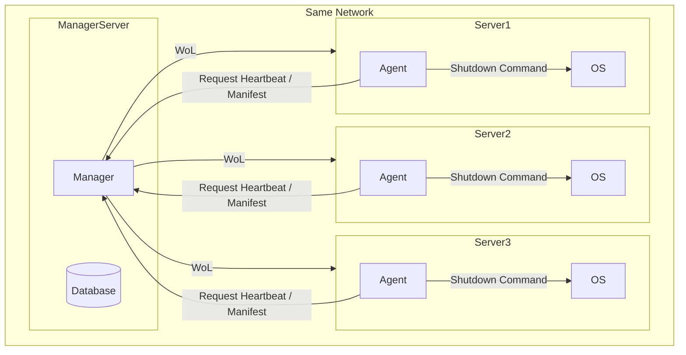

# System Design Document - システムデザイン

## Architecture

## Database

- RDB: sqlite

## Manager

## Technology Stack

- Language: TS (Bun)
- Backend Framework: ElysiaJS
- UI Framework: React

## API

- Protocol: http/https
- Schema: Connect

see: [./proto/](/proto/)

## Agent

## Technology Stack

- Language: Go

## Usage

## Security

## ユーザーの認証

- ID とパスワードは環境変数で管理する
  - ID: 文字列
  - パスワード: scrypt でハッシュ化した文字列
- 認証に成功した場合、cookie を用いてセッションを発行し、以降のアクセスを認証済みとして扱う
- セッションの有効期限は 24 時間とする
- セッションの有効期限が切れていた場合は未認証状態となる
- マネージャーが利用停止になった場合、ユーザーはログインすることができなくなる
- cookie の属性
  - Name: session_id
  - Value: ランダムな UUIDv4
  - Path: /
  - MaxAge: 86400 (24 時間)
  - HttpOnly: true
  - Secure: true
  - SameSite: Strict

## アクセストークン

- エージェントからマネージャーへリクエストする際の認証は Bearer Token 方式を採用する
  - リクエストヘッダーに `Authorization: Bearer {access_token}` を付与する
- 発行されたアクセストークンは、サーバーと紐づけて DB 上に保存する
- DB 上ではアクセストークンは scrypt でハッシュ化して保存する
- アクセストークンはランダムな 32 文字の英数字
- アクセストークンの有効期限は環境変数で管理する
  - 単位: 秒
  - 初期値: 7776000 (90 日)
  - 0 秒を指定することで無期限に設定可能
- ローテーションを実行した場合、保存していたアクセストークンのハッシュ値を上書きする

## CSRF 対策

- CORS にて同一オリジンからのリクエストのみ許可する
- リクエストをすべて単純でないリクエストとし、必ず preflight request を発行させる
- cookie の SameSite 属性を Strict に設定する

## http/https

- localhost 以外からのアクセスに対しては HTTPS を強制する
- localhost からのアクセスに対しては HTTP を許可する
