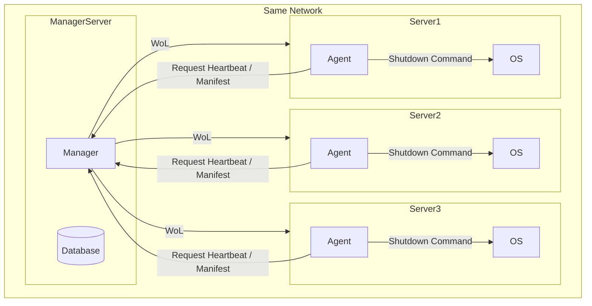
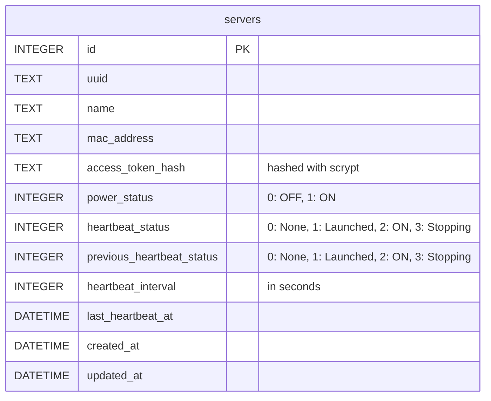
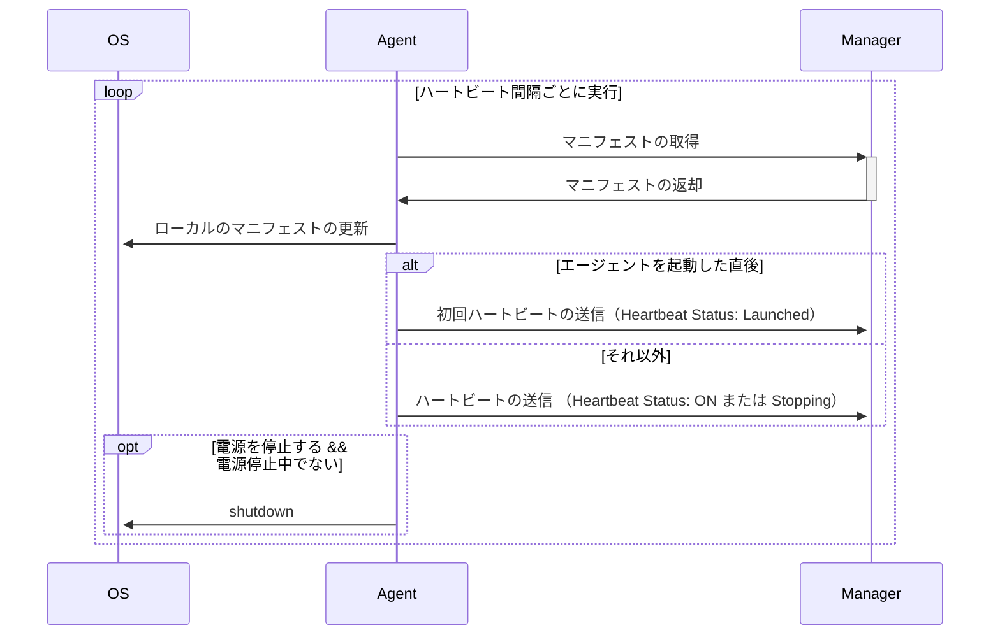

# System Design Document - システムデザイン

## Architecture

## Database

- RDB: sqlite
- DELETE は物理削除で行う

### Tables

## Manager

### Technology Stack

- Language: TS (Bun)
- Backend Framework: ElysiaJS
- UI Framework: React

### API

- Protocol: http/https
- Schema: Connect

see: [./proto/](/proto/)

## Agent

### Technology Stack

- Language: Go

### Usage

電源管理には root 権限が必要であるため、help 以外のコマンドを sudo なしで実行された場合はエラーを返して終了する。

#### `komoriuta help`

- コマンドの使い方を表示する
- args/option
  - なし
- 利用可能なコマンドは他の項目を参照

#### `komoriuta version`

- エージェントのバージョン情報を表示する
- args/option
  - なし

#### `komoriuta init`

エージェントの初期設定を行う

- args/option
  - なし
- エージェントを動かすために必要な情報を対話形式で入力する
  - マネージャーの URL
    - バリデーション
      - 有効な URL であること
      - localhost でない場合は https スキームであること
  - アクセストークン
    - 機密情報のため、入力した内容は画面に表示しない
    - バリデーション
      - 32 文字の大小英数字であること
- 上記の設定を `/etc/komoriuta/config.json` に保存する
  - すでに設定ファイルが存在する場合は上書きする
- 例外処理
  - バリデーションに失敗した場合、エージェントはエラーメッセージを表示して終了する
  - その他の予期しないエラーが発生した場合、エージェントはエラーログを `/var/log/komoriuta/error.log` に出力して終了する

#### `komoriuta run`

エージェントを起動し、マネージャーと通信を開始する

- args/option
  - なし
- マネージャーからマニフェストを受け取る
  - あるべき電源ステータス（ON/OFF）
  - ハートビート間隔
- エージェントは、マニフェストで指定されたハートビート間隔で、マネージャーへ死活状況を報告する
  - ハートビートステータス（Launched/ON/Stopping）
  - 報告のロジックは [./docs/srs.md](/docs/srs.md) を参照
- 電源ステータスが OFF の場合、サーバーの電源を停止する
  - 電源を停止しようとしているときでもマネージャーに対してハートビートは送信し続ける
  - 電源を停止しようとしているときに、電源を停止する旨のマニフェストを受け取ったとしてもシャットダウン処理を重複して行わない
- 例外処理
  - `/etc/komoriuta/config.json` が存在しない場合、エージェントはエラーメッセージを表示して終了する
  - マネージャーに接続できない場合、エージェントは 3 回までリトライを行い、それでも接続できない場合はエラーメッセージを表示して終了する
  - マニフェストの取得やハートビートの送信に失敗した場合、エージェントは 3 回までリトライを行い、それでも失敗する場合はエラーメッセージを表示して終了する
  - localhost 以外の URL で http 通信を行おうとした場合、エージェントは https で通信するよう通知するエラーメッセージを表示して終了する
  - その他の予期しないエラーが発生した場合、エージェントはエラーログを `/var/log/komoriuta/error.log` に出力して終了する

#### `komoriuta set [target]`

- エージェントの設定を変更する
- args/option
  - target: 設定を変更する対象（manager_url または access_token）
- 指定された値を対話形式で入力する
  - バリデーション等は `komoriuta init` と同様
- 入力された値で対象の設定を上書きする
- 例外
  - `/etc/komoriuta/config.json` が存在しない場合、エージェントはエラーメッセージを表示して終了する
  - target が不正な場合、エージェントはエラーメッセージを表示して終了する
  - 不正な値が入力された場合、エージェントはエラーメッセージを表示して終了する
  - その他の予期しないエラーが発生した場合、エージェントはエラーログを `/var/log/komoriuta/error.log` に出力して終了する

## Security

### ユーザーの認証

- ID とパスワードは環境変数で管理する
  - ID: 文字列
  - パスワード: scrypt でハッシュ化した文字列
- 認証に成功した場合、cookie を用いてセッションを発行し、以降のアクセスを認証済みとして扱う
- セッションの有効期限は環境変数から設定する
  - 単位: 秒
  - 初期値: 86400 (24 時間)
  - バリデーション: 1 以上の整数
- セッションの有効期限が切れていた場合は未認証状態となる
- マネージャーが利用停止になった場合、ユーザーはログインすることができなくなる
- cookie の属性
  - Name: session_id
  - Value: ランダムな UUIDv4
  - Path: /
  - MaxAge: 指定されたセッションの有効期限に準ずる
  - HttpOnly: true
  - Secure: true
  - SameSite: Strict

### アクセストークン

- 形式
  - 32 文字の大小英数字
- 有効期限
  - 環境変数で管理する
  - 単位: 秒
  - 初期値: 7776000 (90 日)
  - 0 秒を指定することで無期限に設定可能
- バリデーション
  - 0 以上の整数
- エージェントからマネージャーへリクエストする際の認証は Bearer Token 方式を採用する
  - リクエストヘッダーに Base64 でエンコードしたアクセストークンを `Authorization: Bearer {access_token}` の形式で含める
- 発行されたアクセストークンは、サーバーと紐づけて DB 上に保存する
- DB 上ではアクセストークンは scrypt でハッシュ化して保存する
- ローテーションを実行した場合、保存していたアクセストークンのハッシュ値を上書きする

### CSRF 対策

- CORS にて同一オリジンからのリクエストのみ許可する
- リクエストをすべて単純でないリクエストとし、必ず preflight request を発行させる
- cookie の SameSite 属性を Strict に設定する

### http/https

- localhost 以外からのアクセスに対しては HTTPS を強制する
- localhost からのアクセスに対しては HTTP を許可する
