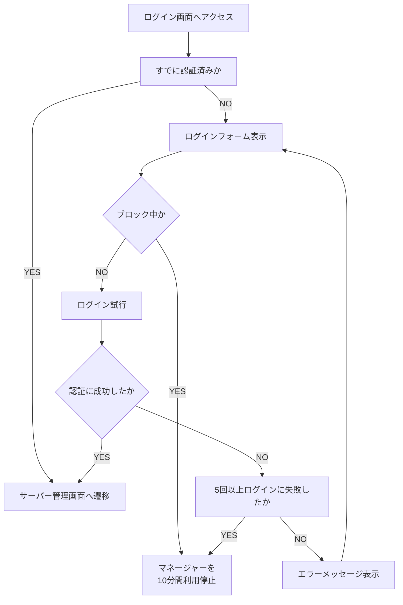
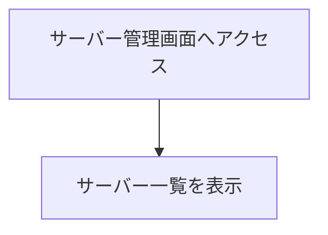
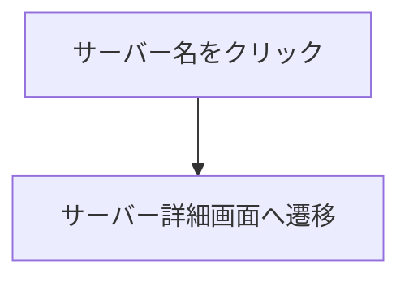
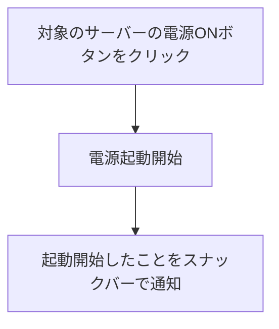
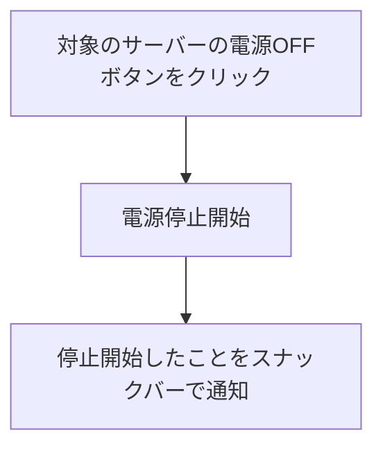
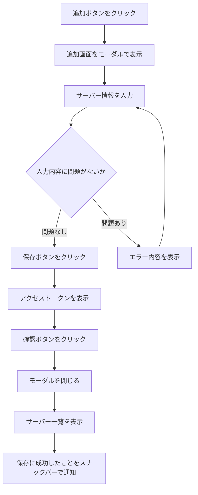
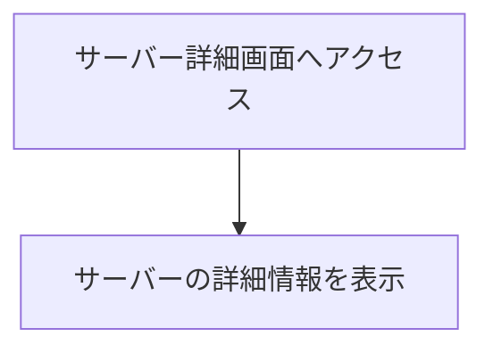
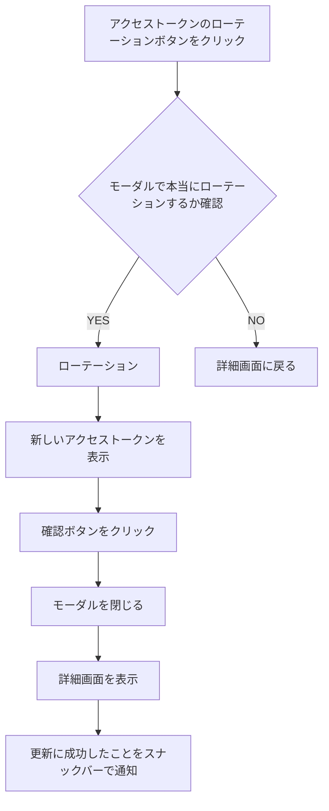
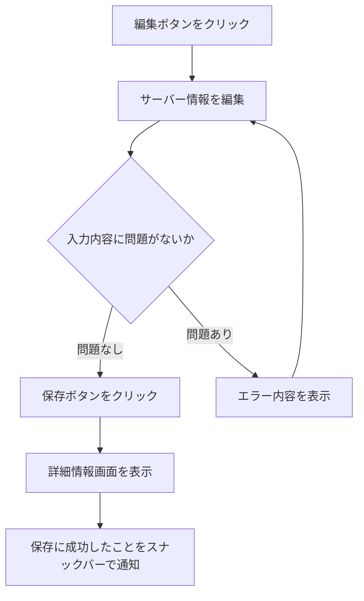
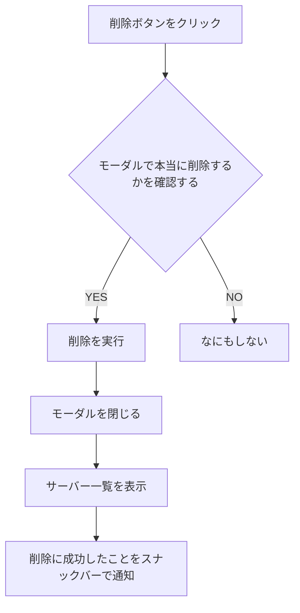

# Software Requirements Specification - 要件定義

## 用語の定義

- **Komoriuta / 子守唄**
  - サーバーの電源管理を行うためのアプリケーションの総称
  - サーバーを「寝かしつける」ことから命名
- **User / ユーザー**
  - 各アプリケーションを利用するサーバー管理者
- **Server / サーバー**
  - 電源管理をおこなう対象の物理サーバー
  - サーバーはマネージャーが規定する電源ステータスに従う
- **Manager / マネージャー**
  - 各サーバーの電源管理を行うアプリケーション
  - マネージャーは、サーバーがあるべき電源ステータスを規定する
  - マネージャーは、エージェントが参照する API や、ユーザーがアクセスする管理画面を提供する
- **Agent / エージェント**
  - 各サーバーに在中し、マネージャーと通信を行うデーモン
  - エージェントは、マネージャーへハートビートの送信や、サーバーのシャットダウン命令を行う
- **Manifest / マニフェスト**
  - 各サーバーがあるべき状態を規定した情報
  - 内容
    - 電源ステータス（ON/OFF）
    - ハートビート間隔
- **Heartbeat / ハートビート**
  - エージェントがマネージャーへ送信する死活状態
- **Heartbeat Interval / ハートビート間隔**
  - エージェントが送信するハートビートの間隔
- **Power Status / 電源ステータス**
  - マネージャーが規定する、各サーバーのあるべき電源の状態
  - 種類
    - ON
      - 意味: 電源が起動している
      - 条件: マネージャー上で電源ステータスを ON にした場合
    - OFF
      - 意味: 電源が停止している
      - 条件: マネージャー上で電源ステータスを OFF にした場合
- **Heartbeat Status / ハートビートステータス**
  - 各サーバーがハートビートで報告する現在の電源の状態
  - ハートビートで報告する内容は基本的にマニフェストの内容に従う
  - 種類
    - Launched:
      - 意味: サーバー内のエージェントが起動した直後
      - 条件: エージェントが起動してから初回のハートビートを報告する場合
    - ON:
      - 意味: 電源が起動している
      - 条件: マニフェストの電源ステータスが ON、かつハートビートを正常に報告できる場合
      - 補足:
        - エージェントのプロセスが稼働し続けている場合に、マネージャーと通信ができない状態から復帰した際も含む
    - Stopping:
      - 意味: 電源を停止中
      - 条件: マニフェストの電源ステータスが OFF、かつハートビートを正常に報告できる場合
    - None（報告なし）
      - 意味: エージェントが停止している
      - 条件: 前回のハートビート更新から、エージェントが指定されたハートビート間隔 x3 のマージン内にハートビートが報告されなかった場合
      - 補足:
        - 基本的にはサーバーの電源が停止したときになるステータス
        - ネットワーク障害等によりエージェントのプロセスは稼働しているがマネージャーと通信できない場合も含む
        - 前回のハートビートから None が継続する場合、ハートビートは更新されない（None が連続して報告されることはない）
- **Current Status / カレントステータス**
  - 電源ステータスとハートビートステータスの状況から算出される現在の状態
  - 種類
    - Applying
      - 意味: 電源ステータスの変更を適用中
      - 条件:
        - 電源ステータスを更新してから次のハートビートを更新するまでの間
        - マネージャー自体が起動してから最初のハートビートを更新するまでの間
      - 補足:
        - この状態の間は電源ステータスを変更できない
    - ON
      - 意味: 電源が起動している
      - 条件: 電源ステータスが ON、かつハートビートステータスが ON または Launched
      - 補足:
        - 何らかの理由でプロセスがダウンしている状態から復帰した場合も含む
    - SyncedON（表記上は ON）
      - 意味: サーバーの電源が手動で起動されたなど、サーバーの実態に合わせて電源ステータスを自動的に ON に変更した状態
      - 条件: 電源ステータスが OFF、かつ前回のハートビートステータスが None、かつ現在のハートビートステータスが Launched
      - 補足:
        - 基本的にサーバーの電源が手動で起動した場合を想定
        - カレントステータスは ON と同様に扱い、電源ステータスを自動的に ON に変更して、ユーザーに通知する
    - OFF
      - 意味: 電源が停止している
      - 条件: 電源ステータスが OFF、かつ前回のハートビートステータスが Stopping、かつ現在のハートビートステータスが None
    - SyncedOFF（表記上は OFF）
      - 意味: 手動で電源が停止したなど、サーバーの実態に合わせて電源ステータスを自動的に OFF に変更した状態
      - 条件: 現在のハートビートステータスが None で 5 分以上経過した場合
      - 補足:
        - 基本的にサーバーの電源が手動で停止した場合を想定
        - カレントステータスは OFF と同様に扱い、電源ステータスを自動的に OFF に変更して、ユーザーに通知する
    - Starting
      - 意味: 電源を起動中
      - 条件: 電源ステータスが ON、かつ前回のハートビートステータスが Stopping、かつ現在のハートビートステータスが None
      - 補足:
        - 起動処理が開始された後、ハートビートステータスが Launched になるまでの間は電源ステータスを変更できない
        - 5 分以上経過した場合は、電源の起動に失敗したとして、ユーザーへの通知とともに SyncedOFF に移行する
    - Stopping
      - 意味: 電源を停止中
      - 条件: 電源ステータスが OFF、かつハートビートステータスが Stopping
      - 補足:
        - 停止処理が開始された後、ハートビートステータスが None になるまでの間は電源ステータスを変更できない
    - Lost
      - 意味: サーバーからのハートビートが途絶えた場合
      - 条件: 前回のハートビートステータスが Stopping 以外、かつ現在のハートビートステータスが None
      - 補足:
        - 何らかの理由でエージェントと通信ができなくなった場合を想定している
        - サーバーの電源が手動で OFF になった場合も含む
        - 通信が途絶した旨をユーザーに通知する
    - Warning
      - 意味: 注意が必要な状態であるとき
      - 条件:
        - 2 連続で Launched が報告された場合
          - 連続でマネージャーが再起動を繰り返している
        - 電源ステータスが OFF、かつ前回のハートビートステータスが ON または Stopping、かつ現在のハートビートステータスが Launched
          - 電源停止中にマネージャーが再起動している
      - 補足
        - Warning になった場合はユーザーにその旨を通知
    - Error
      - 意味: 想定しない状況であるとき
      - 条件: 上記以外
      - 補足
        - Error になった場合はユーザーにその旨を通知
  - 優先度
    - ON/OFF < SyncedON/SyncedOFF < Starting/Stopping < Applying < Lost < Error

## 各ステータスの関係性

### 正常系

| 電源ステータス | 前回のハートビートステータス | 現在受け取ったハートビートステータス | カレントステータス         | 状況                                                                                 |
| -------------- | ---------------------------- | ------------------------------------ | -------------------------- | ------------------------------------------------------------------------------------ |
| ON/OFF         | -                            | -                                    | Applying                   | 電源ステータスの変更を適用中                                                         |
| ON             | Launched                     | Launched                             | Warning                    | マネージャーが再起動を繰り返している                                                 |
| ON             | Launched                     | ON                                   | ON                         | 正常稼働                                                                             |
| ON             | Launched                     | None                                 | Lost / SyncedOFF (OFF)     | エージェントとの通信途絶 or サーバーの電源が手動で OFF → 5 分経過で SyncedOFF へ移行 |
| ON             | ON                           | Launched                             | ON                         | マネージャーが再起動した                                                             |
| ON             | ON                           | ON                                   | ON                         | 正常稼働                                                                             |
| ON             | ON                           | None                                 | Lost / SyncedOFF (OFF)     | エージェントとの通信途絶 or サーバーの電源が手動で OFF → 5 分経過で SyncedOFF へ移行 |
| ON             | Stopping                     | None                                 | Starting / SyncedOFF (OFF) | 電源起動中 → 5 分経過で SyncedOFF へ移行                                             |
| ON             | None                         | Launched                             | ON                         | 電源が入った                                                                         |
| ON             | None                         | ON                                   | ON                         | 通信できない状態から復帰した場合                                                     |
| OFF            | Launched                     | Launched                             | Warning                    | マネージャーが再起動を繰り返している                                                 |
| OFF            | Launched                     | Stopping                             | Stopping                   | 停止処理開始                                                                         |
| OFF            | Launched                     | None                                 | Lost / SyncedOFF (OFF)     | エージェントとの通信途絶 or サーバーの電源が手動で OFF → 5 分経過で SyncedOFF へ移行 |
| OFF            | ON                           | Launched                             | Warning                    | 電源停止中にマネージャーが再起動している                                             |
| OFF            | ON                           | Stopping                             | Stopping                   | 停止処理開始                                                                         |
| OFF            | ON                           | None                                 | Lost / SyncedOFF (OFF)     | エージェントとの通信途絶 or サーバーの電源が手動で OFF → 5 分経過で SyncedOFF へ移行 |
| OFF            | Stopping                     | Launched                             | Warning                    | 電源停止中にマネージャーが再起動している                                             |
| OFF            | Stopping                     | Stopping                             | Stopping                   | シャットダウン中                                                                     |
| OFF            | Stopping                     | None                                 | OFF                        | 正常に電源が落ちた                                                                   |
| OFF            | None                         | Launched                             | SyncedON (ON)              | 電源ステータスを自動的に ON に変更                                                   |
| OFF            | None                         | Stopping                             | Stopping                   | 通信できない状態から復帰した場合                                                     |

### 異常系

| 電源ステータス | 前回のハートビートステータス | 現在受け取ったハートビートステータス | カレントステータス | 状況                                                                                                                                                                                                                     |
| -------------- | ---------------------------- | ------------------------------------ | ------------------ | ------------------------------------------------------------------------------------------------------------------------------------------------------------------------------------------------------------------------ |
| ON             | Launched                     | Stopping                             | Error              | Stopping は電源ステータスが OFF のときのみ報告できる                                                                                                                                                                     |
| ON             | ON                           | Stopping                             | Error              | 〃                                                                                                                                                                                                                       |
| ON             | Stopping                     | Launched                             | Error              | Stopping は電源ステータスが OFF のときのみ、かつ Stopping 中は電源が落ちるまで電源ステータスを変更できないので、電源ステータスが ON かつ前回のハートビートステータスが Stopping のときに None 以外が報告されることはない |
| ON             | Stopping                     | ON                                   | Error              | 〃                                                                                                                                                                                                                       |
| ON             | Stopping                     | Stopping                             | Error              | 〃                                                                                                                                                                                                                       |
| ON             | None                         | Stopping                             | Error              | Stopping は電源ステータスが OFF のときのみ                                                                                                                                                                               |
| ON             | None                         | None                                 | Error              | None が連続して報告されることはない                                                                                                                                                                                      |
| OFF            | Launched                     | ON                                   | Error              | 電源ステータスが OFF のときにハートビートステータスが ON になることはない                                                                                                                                                |
| OFF            | ON                           | ON                                   | Error              | 〃                                                                                                                                                                                                                       |
| OFF            | Stopping                     | ON                                   | Error              | 〃                                                                                                                                                                                                                       |
| OFF            | None                         | ON                                   | Error              | 〃                                                                                                                                                                                                                       |
| OFF            | None                         | None                                 | Error              | None が連続して報告されることはない                                                                                                                                                                                      |

## 各画面やコンポーネントと機能

### ログイン画面（/login）

ユーザーの認証を行う画面。

#### ユーザーの認証

- ユーザーは ID とパスワードを用いて認証を行う
- ユーザーの新規登録は行わない
- 5 回以上ログインに失敗した場合、IP アドレス単位でマネージャーを 10 分間利用停止する
- 認証に成功した場合、サーバー管理画面へ遷移する

### サーバー管理画面（/servers）

サーバーを個別に管理する画面。

#### 管理下にあるサーバーの一覧表示

- 管理下にある各サーバーの情報を一覧を表示する
  - サーバー名
  - サーバーに割り振られる一意の ID
  - 電源ステータス
  - カレントステータス
  - 電源ボタン
    - 電源ステータスが OFF の場合は ON ボタンを表示
    - 電源ステータスが ON の場合は OFF ボタンを表示

#### サーバーの詳細ページへ遷移

#### サーバーの電源起動

- 電源の起動はマネージャーから対象のサーバーに対して起動命令を送出する
- 電源起動後のサーバーの電源ステータスは Starting となる

#### サーバーの電源停止

- 電源停止後のサーバーの電源ステータスは Stopping となる

#### サーバーの追加

- サーバー追加モーダルを表示し、以下の内容を入力する
  - サーバー名（必須）
    - 1 文字以上の文字列
  - MAC アドレス（必須）
    - パターン: `/^[0-9A-Fa-f]{2}(:[0-9A-Fa-f]{2}){5}$/`
  - ハートビート間隔（必須）
    - 単位: s
    - 範囲: 5 〜 60
    - 初期値: 10s
- アクセストークンは発行時のみ表示し、以降画面上に表示されることはない
- アクセストークン表示時に使い方を明記する
- 電源ステータスは OFF、 前回のハートビートは Stopping、現在のハートビートは None で登録される

### サーバー詳細画面（/servers/{id}）

#### サーバーの詳細情報の表示

- 以下の情報を表示する
  - サーバー名
  - サーバーに割り振られる一意の ID
  - 電源状態
  - MAC アドレス
  - ハートビート間隔
  - 電源ボタン
  - 編集ボタン
  - アクセストークンのローテーションボタン
  - 削除ボタン

#### サーバーのアクセストークンのローテーション

- アクセストークンのローテーションを実行した場合、既存のアクセストークンは無効化される

#### サーバーの編集

- 現在の設定がフォームに入力された状態で表示
- 編集項目は「サーバーの追加」の内容と同じ

#### サーバーの削除

### ヘッダー・フッター・ナビゲーション

#### ヘッダー

- ヘッダー左側
  - ハンバーガーメニューアイコンを表示
- ヘッダー右側
  - 人間のシルエットが描かれた丸いアイコンを表示
  - アイコンをクリックすると、ドロップダウンで「ログアウト」ボタンが表示される
  - ログアウトボタンをクリックするとログアウトが実行され、ログインページへと遷移する

#### ナビゲーションバー

- 画面左側にナビゲーションバーを在中させる
- ナビゲーションには各ページへのリンクが存在する
  - 現在はサーバー一覧画面のみ

#### エラー・警告通知（フッター）

- エラー・警告通知は常に最上位のレイヤーとして表示される
  - モーダルよりも上に表示される
- アプリケーションで規定されているエラーや、その他予期しないエラーが発生した場合はすべてフッターに表示する
- フッターの右側にはバツボタンが表示されており、クリックするとフッターが閉じる

## 非機能要求

- 快適に各アプリケーションを利用できるパフォーマンス
  - 特にエージェントは在中するため、サーバーのリソースを大きく消費してはならない
- 堅牢なセキュリティ
  - 不正アクセスや情報漏洩を防止するための仕組みを実装する

## 次回以降のリリース

- サーバーセット管理画面の実装
  - 登録した複数のサーバーに対して一括で電源操作を行う機能
