# Software Requirements Specification - 要件定義

## 用語の定義

- **Komoriuta / 子守唄**
  - サーバーの電源管理を行うためのアプリケーションの総称
  - サーバーを「眠らせる」ことから命名
- **User / ユーザー**
  - 各アプリケーションを利用するサーバー管理者
- **Server / サーバー**
  - 電源管理をおこなう対象の物理サーバー
  - サーバーはマネージャー（後述）が規定する電源ステータスに従う
- **Manager / マネージャー**
  - 各サーバーの電源管理を行うアプリケーション
  - マネージャーは各サーバーがあるべき電源ステータス（後述）を規定する
  - エージェントが参照する API や、ユーザーがアクセスする管理画面を提供する
- **Agent / エージェント**
  - 各サーバーに在中し、マネージャーと通信を行うデーモン
- **Manifest / マニフェスト**
  - 各サーバーがあるべき状態を規定した情報
  - 内容
    - 電源ステータス（ON/OFF）
    - ハートビート間隔
- **Wake-on-LAN (WoL)**
  - サーバーの電源を起動するための仕組み
  - マネージャーが、MAC アドレスを用いて Magic Packet を送出する
  - 前提条件:
    - サーバーの BIOS/UEFI で WoL が有効化されている
    - マネージャーとサーバーが同一ネットワークセグメント内にある（またはルーターが WoL パケットを転送可能）
- **Heartbeat / ハートビート**
  - エージェントがマネージャーへ送信する死活状態
- **Heartbeat Interval / ハートビート間隔**
  - エージェントが送信するハートビートの間隔
- **Power Status / 電源ステータス**
  - マネージャーが規定する、各サーバーのあるべき電源の状態
  - 種類
    - ON
      - 意味: 電源が起動している
      - 条件: マネージャー上で電源ステータスを ON にした場合
    - OFF
      - 意味: 電源が停止している
      - 条件: マネージャー上で電源ステータスを OFF にした場合
- **Heartbeat Status / ハートビートステータス**
  - 各サーバーがハートビートで報告する現在の電源の状態
  - ハートビートで報告する内容は基本的にマニフェストの内容に従う
  - 種類
    - Launched:
      - 意味: サーバー内のエージェントが起動した直後
      - 条件: エージェントが起動してから初回のハートビートを報告する場合
    - ON:
      - 意味: 電源が起動している
      - 条件: マニフェストの電源ステータスが ON、かつハートビートを正常に報告できる場合
    - Stopping:
      - 意味: 電源を停止中
      - 条件: マニフェストの電源ステータスが OFF、かつハートビートを正常に報告できる場合
    - None（報告なし）
      - 意味: エージェントが停止している
      - 条件: エージェントがハートビートを報告できない状況にあるとき
- **Current Status / カレントステータス**
  - 電源ステータスとハートビートステータスの状況から算出される現在の状態
  - 種類
    - ON
      - 意味: 電源が起動している
      - 条件: 電源ステータスが ON、かつハートビートステータスが ON または Launched
      - 補足:
        - 何らかの理由でプロセスがダウンしている状態から復帰した場合も含む
    - OFF
      - 意味: 電源が停止している
      - 条件: 電源ステータスが OFF、かつ前回のハートビートステータスが Stopping、かつ現在のハートビートステータスが None
    - Starting
      - 意味: 電源を起動中
      - 条件: 電源ステータスが ON、かつ前回のハートビートステータスが Stopping、かつ現在のハートビートステータスが None
    - BeforeStopping
      - 意味: 電源の停止を開始した
      - 条件: 電源ステータスが OFF、前回および現在のハートビートステータスが Launched または ON
    - Stopping
      - 意味: 電源を停止中
      - 条件: 電源ステータスが OFF、かつハートビートステータスが Stopping
    - ManuallyON
      - 意味: サーバーが手動で電源がオンになった場合
      - 条件: 電源ステータスが OFF、前回のハートビートステータスが None または Stopping、かつ現在のハートビートステータスが Launched
    - Lost
      - 意味: 不明な理由によりサーバーからのハートビートが途絶えた場合
      - 条件: 前回のハートビートステータスが Launched または ON、かつ現在のハートビートステータスが None
      - 補足
        - サーバーが異常の状態であるか、正常動作かの判断ができないため、電源ステータスを更新するようフッターにて通知する必要がある
    - Error
      - 意味: 想定しない状況であるとき
      - 条件: 上記以外
      - 補足
        - Error になった場合はユーザーにその旨をフッターを用いて通知

## 各ステータスの関係性

| 電源ステータス | 前回のハートビートステータス | 現在のハートビートステータス | カレントステータス | 状況                                                                                                                                                                                                           |
| -------------- | ---------------------------- | ---------------------------- | ------------------ | -------------------------------------------------------------------------------------------------------------------------------------------------------------------------------------------------------------- |
| ON             | Launched                     | Launched                     | ON                 | （OK）何らかの理由でプロセスがダウンしている状態から復帰                                                                                                                                                       |
| ON             | Launched                     | ON                           | ON                 | （OK）正常稼働                                                                                                                                                                                                 |
| ON             | Launched                     | Stopping                     | Error              | （あり得ない）Stopping は電源ステータスが OFF のときのみ                                                                                                                                                       |
| ON             | Launched                     | None                         | Lost               | （要対応）クラッシュした or 手動で電源が OFF                                                                                                                                                                   |
| ON             | ON                           | Launched                     | ON                 | （OK）何らかの理由でプロセスがダウンしている状態から復帰                                                                                                                                                       |
| ON             | ON                           | ON                           | ON                 | （OK）正常稼働                                                                                                                                                                                                 |
| ON             | ON                           | Stopping                     | Error              | （あり得ない）Stopping は電源ステータスが OFF のときのみ                                                                                                                                                       |
| ON             | ON                           | None                         | Lost               | （要対応）クラッシュした or 手動で電源が OFF                                                                                                                                                                   |
| ON             | Stopping                     | Launched                     | Error              | （あり得ない）Stopping は電源ステータスが OFF のときのみ、かつ待機時間中は電源ステータスを変更できない                                                                                                         |
| ON             | Stopping                     | ON                           | Error              | （あり得ない）〃                                                                                                                                                                                               |
| ON             | Stopping                     | Stopping                     | Error              | （あり得ない）〃                                                                                                                                                                                               |
| ON             | Stopping                     | None                         | Starting           | （OK）電源起動中                                                                                                                                                                                               |
| ON             | None                         | Launched                     | ON                 | （OK）電源が入った or クラッシュ状態から復帰した or 手動で電源を落としてから再度入れた → 正常稼働になった                                                                                                      |
| ON             | None                         | ON                           | Error              | （あり得ない）Launched を経由せずにいきなり ON になることはない                                                                                                                                                |
| ON             | None                         | Stopping                     | Error              | （あり得ない）Stopping は電源ステータスが OFF のときのみ                                                                                                                                                       |
| ON             | None                         | None                         | Error              | （あり得ない）None が連続で報告されることはない                                                                                                                                                                |
| OFF            | Launched                     | Launched                     | BeforeStopping     | （OK）基本的には電源ステータスを OFF にした直後。ただ、電源ステータスを OFF にし、すぐサーバーの電源を手動で停止、再度起動した後、ハートビート間隔内に初回ハートビートを送信できれば行けるが、これは考慮しない |
| OFF            | Launched                     | ON                           | BeforeStopping     | （OK）サーバー停止前                                                                                                                                                                                           |
| OFF            | Launched                     | Stopping                     | Stopping           | （OK）停止処理開始                                                                                                                                                                                             |
| OFF            | Launched                     | None                         | Lost               | （要対応）クラッシュした or 手動で電源が OFF                                                                                                                                                                   |
| OFF            | ON                           | Launched                     | BeforeStopping     | （OK）基本的には電源ステータスを OFF にした直後。ただ、電源ステータスを OFF にし、すぐサーバーの電源を手動で停止、再度起動した後、ハートビート間隔内に初回ハートビートを送信できれば行けるが、これは考慮しない |
| OFF            | ON                           | ON                           | BeforeStopping     | （OK）サーバー停止前                                                                                                                                                                                           |
| OFF            | ON                           | Stopping                     | Stopping           | （OK）停止処理開始                                                                                                                                                                                             |
| OFF            | ON                           | None                         | Lost               | （要対応）クラッシュした or 手動で電源が OFF                                                                                                                                                                   |
| OFF            | Stopping                     | Launched                     | ManuallyON         | （OK）サーバーの電源が OFF になった後、すぐ電源を手動で ON にし、ハートビート間隔内にハートビートが送信できた場合                                                                                              |
| OFF            | Stopping                     | ON                           | Error              | （あり得ない）Launched を経由せず ON になることはない                                                                                                                                                          |
| OFF            | Stopping                     | Stopping                     | Stopping           | （OK）シャットダウン中                                                                                                                                                                                         |
| OFF            | Stopping                     | None                         | OFF                | （OK）正常に電源が落ちた                                                                                                                                                                                       |
| OFF            | None                         | Launched                     | ManuallyON         | （OK）手動で電源が ON になった → 電源ステータスを ON に変える必要がある                                                                                                                                        |
| OFF            | None                         | ON                           | Error              | （あり得ない）Launched を経由せず ON になることはない                                                                                                                                                          |
| OFF            | None                         | Stopping                     | Error              | （あり得ない）一度電源が落ちた状態から初回のハートビートは必ず Launched になるためあり得ない                                                                                                                   |
| OFF            | None                         | None                         | Error              | （あり得ない）None が連続で報告されることはない                                                                                                                                                                |

## 全体のシーケンス図

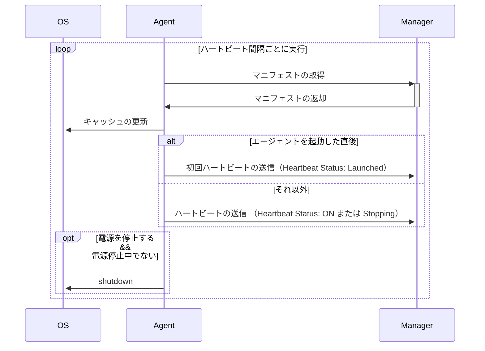

- マネージャーからマニフェストを受け取る
  - あるべき電源ステータス（ON/OFF）
  - ハートビート間隔
- エージェントは、マネージャーに向けて指定されたハートビート間隔で死活状況を報告する
  - 電源ステータス（Launched/ON/Stopping）
  - 初回のハートビートは Launched として報告する
- マニフェストに書かれた情報に基づいてサーバーの電源を停止する
- 電源を停止しようとしているときでもマネージャーに対してハートビートは送信し続ける
- 電源を停止しようとしているときに、電源を停止する旨のマニフェストを受け取ったとしてもシャットダウン処理は重複して行わない

## 各画面やコンポーネントと機能

### ログイン画面（/login）

ユーザーの認証を行う画面。

#### ユーザーの認証

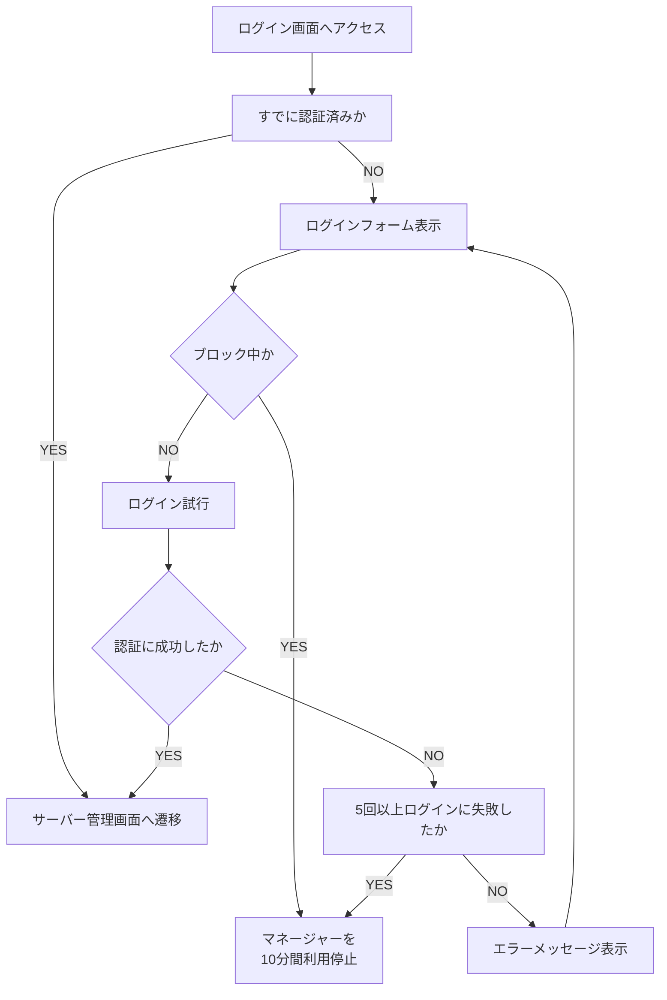

- ユーザーは ID とパスワードを用いて認証を行う
- ユーザーの新規登録は行わない
- 5 回以上ログインに失敗した場合、マネージャーを 10 分間利用停止する
- 認証に成功した場合、サーバー管理画面へ遷移する

### サーバー管理画面（/servers）

サーバーを個別に管理する画面。

#### 管理下にあるサーバーの一覧表示

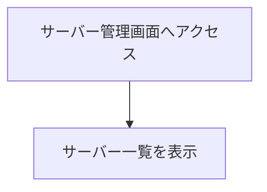

- 管理下にある各サーバーの情報を一覧を表示する
  - サーバー名
  - サーバーに割り振られる一意の ID
  - 電源ステータス
  - カレントステータス
  - 電源ボタン
    - 電源ステータスが OFF の場合は ON ボタンを表示
    - 電源ステータスが ON の場合は OFF ボタンを表示

#### サーバーの詳細ページへ遷移

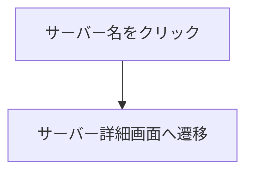

#### サーバーの電源起動

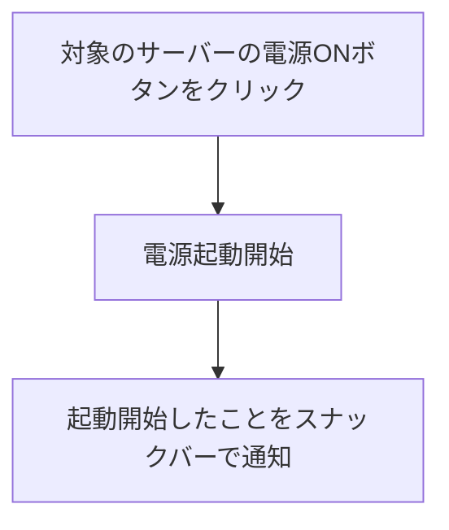

- 電源の起動はマネージャーから対象のサーバーに対して Magic Packet を送出する（WoL）
- 電源起動後のサーバーの電源ステータスは Starting となる

#### サーバーの電源停止

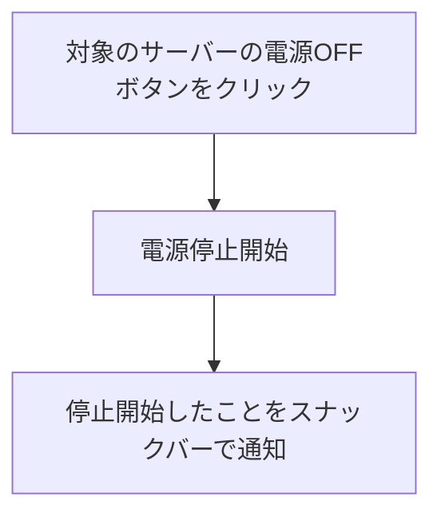

- 電源停止後のサーバーの電源ステータスは Stopping となる

#### サーバーの追加

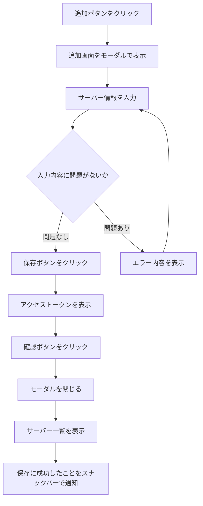

- サーバー追加モーダルを表示し、以下の内容を入力する
  - サーバー名（必須）
    - 1 文字以上の文字列
  - MAC アドレス（必須）
    - パターン: `/^[0-9A-Fa-f]{2}(:[0-9A-Fa-f]{2}){5}$/`
  - ハートビート間隔（必須）
    - 単位: s
    - 正の整数のみ
    - 初期値: 10s
- アクセストークンは発行時のみ表示し、以降画面上に表示されることはない
- アクセストークン表示時に使い方を明記する

### サーバー詳細画面（/servers/{id}）

#### サーバーの詳細情報の表示

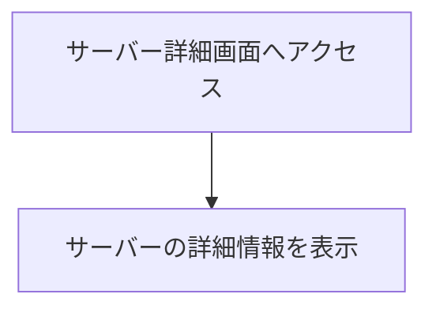

- 以下の情報を表示する
  - サーバー名
  - サーバーに割り振られる一意の ID
  - 電源状態
  - MAC アドレス
  - ハートビート間隔
  - 電源ボタン
  - 編集ボタン
  - アクセストークンのローテーションボタン
  - 削除ボタン

#### サーバーのアクセストークンのローテーション

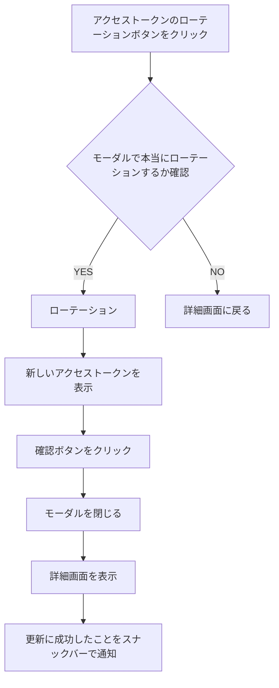

- アクセストークンのローテーションを実行した場合、既存のアクセストークンは無効化される

#### サーバーの編集

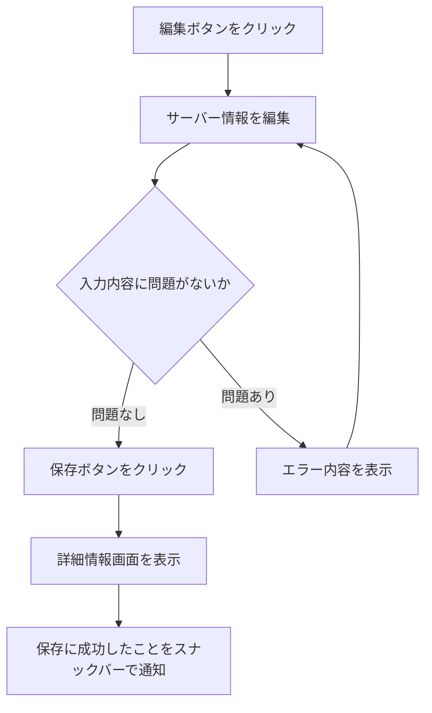

- 現在の設定がフォームに入力された状態で表示
- 編集項目は「サーバーの追加」の内容と同じ

#### サーバーの削除

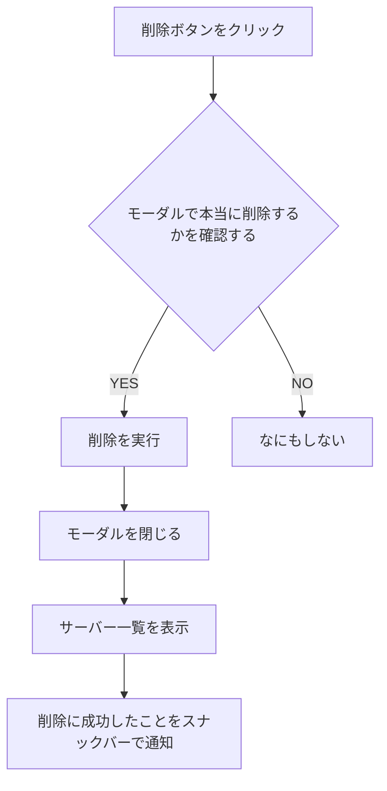

### ヘッダー・フッター・ナビゲーション

#### ヘッダー

- ヘッダー左側
  - ハンバーガーメニューアイコンを表示
- ヘッダー右側
  - 人間のシルエットが描かれた丸いアイコンを表示
  - アイコンをクリックすると、ドロップダウンで「ログアウト」ボタンが表示される
  - ログアウトボタンをクリックするとログアウトが実行され、ログインページへと遷移する

#### ナビゲーションバー

- 画面左側にナビゲーションバーを在中させる
- ナビゲーションには各ページへのリンクが存在する
  - 現在はサーバー一覧画面のみ

#### エラー・警告通知（フッター）

- エラー・警告通知は常に最上位のレイヤーとして表示される
  - モーダルよりも上に表示される
- アプリケーションで規定されているエラーや、その他予期しないエラーが発生した場合はすべてフッターに表示する
- フッターの右側にはバツボタンが表示されており、クリックするとフッターが閉じる

## 非機能要求

- 快適に各アプリケーションを利用できるパフォーマンス
  - 特にエージェントは在中するため、サーバーのリソースを大きく消費してはならない
- 堅牢なセキュリティ
  - 不正アクセスや情報漏洩を防止するための仕組みを実装する

## 次回以降のリリース

- サーバーセット管理画面の実装
  - 登録した複数のサーバーに対して一括で電源操作を行う機能
